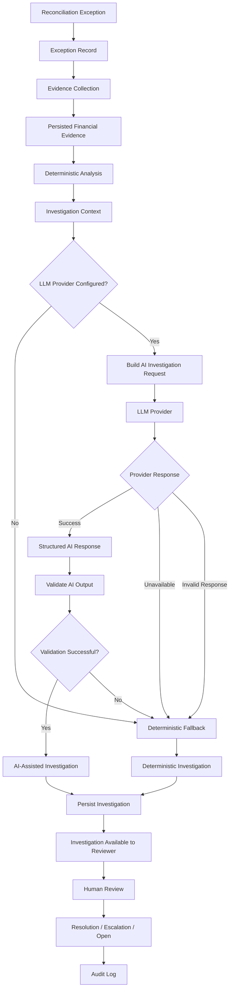

# RazorRecon AI — AI Investigation Flow



## Investigation Layers

The investigation pipeline has three distinct reasoning layers.

### Layer 1 — Deterministic Facts

The application establishes facts from persisted financial data.

Examples include:

* payment amount
* settlement amount
* payment/settlement relationship
* reconciliation status
* financial difference
* available refunds
* available fees
* available adjustments
* exception type

These facts are not generated by the LLM.

---

### Layer 2 — AI Interpretation

When the AI provider is available, the model receives the investigation context and evidence.

The model can assist with:

* discrepancy explanation
* likely root cause
* operational risk interpretation
* investigation summary
* recommended next action

The model is therefore an **investigation assistant**, not the source of financial truth.

---

### Layer 3 — Human Decision

The final operational action remains under human control.

```text
Investigation
     │
     ▼
Human Reviewer
     │
     ├── Resolve
     ├── Escalate
     └── Keep Open
```

The review action is persisted and accompanied by an audit record.

---

## AI Failure Strategy

AI failure is explicitly handled.

```text
                    AI Request
                       │
                       ▼
                LLM Provider
                       │
              ┌────────┴────────┐
              │                 │
           Success            Failure
              │                 │
              ▼                 ▼
        Validate Output   Deterministic
              │             Fallback
        ┌─────┴─────┐           │
        │           │           │
      Valid       Invalid       │
        │           │           │
        ▼           └─────┬─────┘
    AI Analysis            │
        │                  │
        └────────┬─────────┘
                 ▼
           Investigation
```

A provider failure must not prevent an exception from being investigated.

The fallback investigation preserves the deterministic analysis already established by the reconciliation system.

---

## Trust Boundary

```text
┌─────────────────────────────────────────────┐
│        Deterministic Application            │
│                                             │
│  Financial Records                          │
│  Matching                                    │
│  Monetary Calculations                       │
│  Exceptions                                  │
│  Evidence                                    │
│                                             │
└──────────────────────┬──────────────────────┘
                       │
                       │ Evidence / Facts
                       ▼
┌─────────────────────────────────────────────┐
│                 AI Layer                    │
│                                             │
│  Explanation                                │
│  Root-Cause Hypothesis                      │
│  Risk Interpretation                        │
│  Summary                                    │
│  Recommended Action                         │
│                                             │
└──────────────────────┬──────────────────────┘
                       │
                       ▼
                Human Reviewer
```

The trust boundary prevents generated AI content from becoming an implicit replacement for financial records.

---

## Investigation Persistence

The investigation record preserves both deterministic and AI-derived information.

```text
Investigation
│
├── investigation_id
├── exception_id
├── investigation_mode
├── ai_provider_status
├── evidence_count
├── deterministic_analysis
├── ai_analysis
├── fallback_reason
└── created_at
```

This allows reviewers and future systems to distinguish between:

```text
AI_ASSISTED
```

and

```text
DETERMINISTIC_FALLBACK
```

investigations.

It also preserves the reason for an AI fallback when one occurs.

---

## Design Goal

The AI architecture follows a simple rule:

> **Use AI to explain financial anomalies, not to invent financial truth.**
