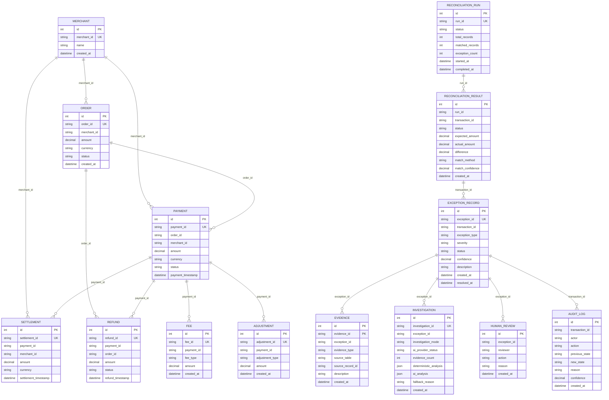

# RazorRecon AI — Database Entity Relationship Diagram

## Overview

PostgreSQL is the system of record for RazorRecon AI.

The database is organized into two major conceptual domains:

1. **Financial domain** — source payment, order, settlement, refund, fee, adjustment, and merchant records.
2. **Reconciliation domain** — reconciliation runs, reconciliation results, exceptions, evidence, investigations, human reviews, and audit logs.

> **Schema note:** The current SQLAlchemy models use indexed string identifiers to represent relationships between domains. These relationships are therefore **logical application-level relationships**, rather than SQLAlchemy `ForeignKey` constraints.

---

## Entity Relationship Diagram



---

## Important Schema Accuracy Note

The diagram intentionally represents the relationships as **logical relationships**.

For example:

```text
Payment.merchant_id → Merchant.merchant_id
Payment.order_id    → Order.order_id
Settlement.payment_id → Payment.payment_id
Investigation.exception_id → ExceptionRecord.exception_id
```

However, the current SQLAlchemy models do not declare these columns using:

```python
ForeignKey(...)
```

Therefore PostgreSQL does not currently enforce these relationships as foreign-key constraints.

This is an important distinction:

```text
Application-level relationship
        ↓
String identifier matching
        ↓
Service/repository logic
```

rather than:

```text
Database-enforced foreign key
        ↓
PostgreSQL constraint
        ↓
Referential integrity
```

The current design favors a lightweight reconciliation schema while keeping identifiers explicit and indexed.

---

# Financial Domain

The financial domain represents the source records used by the reconciliation engine.

```text
Merchant
   │
   ├── Order
   │     │
   │     └── Payment
   │             │
   │             ├── Settlement
   │             ├── Refund
   │             ├── Fee
   │             └── Adjustment
   │
   └── Payment
```

### Merchant

`merchants` represents the merchant/account associated with financial activity.

Key fields:

* `merchant_id` — unique business identifier
* `name`
* `created_at`

### Order

`orders` represents the merchant's expected payment order.

Important fields:

* `order_id`
* `merchant_id`
* `amount`
* `currency`
* `status`

### Payment

`payments` represents the actual payment transaction.

Important fields:

* `payment_id`
* `order_id`
* `merchant_id`
* `amount`
* `currency`
* `status`
* `payment_timestamp`

### Settlement

`settlements` represents money reported as settled for a payment.

Important fields:

* `settlement_id`
* `payment_id`
* `merchant_id`
* `amount`
* `currency`
* `settlement_timestamp`

This is one of the most important tables for reconciliation because the reconciliation engine compares payment expectations against settlement reality.

### Refund

`refunds` represents money returned against a payment.

It references:

* `payment_id`
* `order_id`

and records:

* `amount`
* `status`
* `refund_timestamp`

### Fee

`fees` represents payment-related fees.

Important fields:

* `payment_id`
* `fee_type`
* `amount`

### Adjustment

`adjustments` represents manual or system-generated financial adjustments.

Important fields:

* `payment_id`
* `adjustment_type`
* `amount`

---

# Reconciliation Domain

The reconciliation domain transforms financial source records into deterministic reconciliation outcomes and operational exceptions.

```text
ReconciliationRun
        │
        ▼
ReconciliationResult
        │
        ▼
ExceptionRecord
   ┌────┼──────────────┐
   ▼    ▼              ▼
Evidence Investigation HumanReview
                          │
                          ▼
                      AuditLog
```

---

## ReconciliationRun

`reconciliation_runs` represents one execution of the reconciliation process.

It stores aggregate run-level metrics:

* `total_records`
* `matched_records`
* `exception_count`

and lifecycle information:

* `status`
* `started_at`
* `completed_at`

A run therefore acts as the operational boundary for a reconciliation job.

---

## ReconciliationResult

`reconciliation_results` stores the deterministic outcome for an individual transaction.

Important fields:

* `run_id`
* `transaction_id`
* `status`
* `expected_amount`
* `actual_amount`
* `difference`
* `match_method`
* `match_confidence`

The financial invariant used by the system is:

```text
difference = expected_amount - actual_amount
```

For a missing settlement:

```text
actual_amount = 0
difference = expected_amount
```

This ensures that missing settlement exposure contributes correctly to the dashboard's financial totals.

---

## ExceptionRecord

`exceptions` represents an operational reconciliation exception.

Important fields:

* `exception_id`
* `transaction_id`
* `exception_type`
* `severity`
* `status`
* `confidence`
* `description`
* `created_at`
* `resolved_at`

The exception is the central object for downstream investigation and human review.

Typical exception categories include:

```text
MATCHED
AMOUNT_MISMATCH
MISSING_SETTLEMENT
```

---

# Evidence Model

`evidence` stores factual information collected to support investigation.

Each evidence record identifies:

* `exception_id`
* `evidence_type`
* `source_table`
* `source_record_id`
* `description`

The important architectural principle is:

```text
Financial source records
        ↓
Evidence
        ↓
Investigation
```

The AI investigation should reason over evidence rather than inventing financial facts.

---

# Investigation Model

`investigations` stores the result of an exception investigation.

An investigation contains both deterministic and AI-derived information.

### Deterministic analysis

Stored in:

```text
deterministic_analysis
```

This represents analysis generated by trusted application logic.

### AI analysis

Stored in:

```text
ai_analysis
```

This contains optional LLM-generated interpretation.

### Provider state

```text
ai_provider_status
```

records whether the AI provider succeeded or failed.

### Investigation mode

```text
investigation_mode
```

distinguishes between modes such as:

```text
AI_ASSISTED
DETERMINISTIC_FALLBACK
```

### Fallback reason

If AI is unavailable or produces an invalid response, the reason can be recorded in:

```text
fallback_reason
```

This makes AI degradation observable and auditable.

---

# AI Responsibility Boundary

The database model supports a deliberate separation:

```text
                    TRUSTED SYSTEM
                         │
                         ▼
             PostgreSQL financial facts
                         │
                         ▼
              Deterministic analysis
                         │
                         ▼
                       Evidence
                         │
                         ▼
                  ┌──────────────┐
                  │ AI Analysis  │
                  └──────────────┘
                         │
                         ▼
                   Human Review
                         │
                         ▼
                    Audit Log
```

The AI layer does **not** become the system of record.

It interprets evidence and provides investigation assistance, while financial truth remains grounded in persisted application data.

---

# Human Review

`human_reviews` records decisions made by an operational reviewer.

Fields include:

* `exception_id`
* `reviewer`
* `action`
* `reason`
* `created_at`

This creates a human decision boundary after automated reconciliation and AI-assisted investigation.

Conceptually:

```text
Automated detection
        ↓
Evidence collection
        ↓
AI / deterministic investigation
        ↓
Human decision
```

---

# Audit Model

`audit_logs` records state-changing actions.

Important fields include:

* `transaction_id`
* `actor`
* `action`
* `previous_state`
* `new_state`
* `reason`
* `confidence`
* `created_at`

This provides traceability for operational decisions.

The intended lifecycle is:

```text
Previous State
      ↓
   Action
      ↓
 New State
      ↓
  Reason
      ↓
Audit Log
```

---

# Data Ownership

| Entity                 | Primary responsibility                  |
| ---------------------- | --------------------------------------- |
| `Merchant`             | Merchant identity                       |
| `Order`                | Expected order/payment intent           |
| `Payment`              | Payment transaction                     |
| `Settlement`           | Settlement transaction                  |
| `Refund`               | Refund activity                         |
| `Fee`                  | Payment fee information                 |
| `Adjustment`           | Payment adjustment                      |
| `ReconciliationRun`    | Reconciliation execution                |
| `ReconciliationResult` | Deterministic transaction-level outcome |
| `ExceptionRecord`      | Operational exception lifecycle         |
| `Evidence`             | Factual investigation evidence          |
| `Investigation`        | Deterministic + AI investigation output |
| `HumanReview`          | Human decision                          |
| `AuditLog`             | Historical operational trace            |

---

# Financial Integrity Principles

The reconciliation database follows several important financial-data principles.

## 1. Decimal arithmetic

Financial amounts use:

```text
Numeric(18, 2)
```

rather than floating-point storage.

This avoids floating-point representation errors for monetary values.

## 2. Explicit expected and actual values

Reconciliation results retain both:

```text
expected_amount
actual_amount
```

rather than storing only a calculated difference.

This allows the original comparison to be inspected.

## 3. Explicit difference

The calculated discrepancy is persisted as:

```text
difference
```

This supports dashboard aggregation and exception analysis.

## 4. Missing settlement handling

A missing settlement is represented as:

```text
actual_amount = NULL
difference = expected_amount
```

at persistence time.

The logical financial interpretation is:

```text
missing settlement
        ↓
actual settlement exposure = 0
        ↓
difference = expected amount
```

This prevents missing settlements from disappearing from financial exposure calculations.

---

# Identifier Strategy

The application uses human-readable string identifiers such as:

```text
merchant_id
order_id
payment_id
settlement_id
exception_id
investigation_id
run_id
```

These identifiers are unique and indexed where appropriate.

Internal integer primary keys are retained for database-level row identity:

```text
id
```

This gives the system two useful identity layers:

```text
Internal database identity
        ↓
integer primary key

Business/application identity
        ↓
string identifier
```

---

# Migration Strategy

The current database migration history is:

```text
f91af069443f
        │
        ▼
c451329fa386
        │
        ▼
       HEAD
```

The initial migration establishes the financial and reconciliation schema.

The subsequent migration adds the persisted investigations table.

The application also runs:

```text
alembic upgrade head
```

during backend container startup so the containerized database reaches the expected migration revision before the API starts.

---

# Architecture Principle

The database supports the following overall processing model:

```text
PostgreSQL Facts
       ↓
Deterministic Reconciliation
       ↓
Exception Detection
       ↓
Evidence Collection
       ↓
AI Interpretation
       ↓
Human Decision
       ↓
Audit Trail
```

The most important architectural boundary is:

> **AI assists financial investigation; it does not become the source of financial truth.**

---

# Current Schema Boundary

The current implementation intentionally keeps the schema relatively simple.

Relationships are represented primarily through indexed application identifiers rather than database-level foreign-key constraints.

This provides flexibility during the current prototype/internship implementation, but a future production evolution could introduce explicit foreign-key constraints where the domain semantics require strict referential integrity.

Potential future improvements include:

* explicit PostgreSQL foreign keys
* cascade/restrict policies
* composite indexes for high-volume reconciliation queries
* database-level check constraints for financial invariants
* stronger enum types for lifecycle states
* partitioning for large audit/reconciliation tables
* immutable audit-log enforcement
* row-level security for multi-tenant deployments

These are intentionally documented as future production evolution rather than being claimed as current capabilities.
