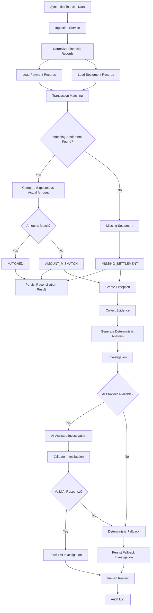

# RazorRecon AI — Reconciliation Data Flow



## Financial Calculation Rule

For a reconciliation result with a settlement:

```text
difference = expected_amount - actual_amount
```

For a missing settlement:

```text
actual_amount = 0
difference = expected_amount
```

This ensures that missing settlements contribute their full expected amount to the financial exposure reported by the dashboard.

## Processing Responsibilities

| Stage                  | Responsibility                                    |
| ---------------------- | ------------------------------------------------- |
| Ingestion              | Load financial source data                        |
| Normalization          | Prepare records for comparison                    |
| Matching               | Identify corresponding payment/settlement records |
| Reconciliation         | Determine financial status                        |
| Exception Detection    | Create exceptions for discrepancies               |
| Evidence Collection    | Gather persisted supporting facts                 |
| Deterministic Analysis | Establish factual investigation context           |
| AI Investigation       | Interpret evidence and explain discrepancies      |
| Fallback               | Preserve investigation capability when AI fails   |
| Human Review           | Make the operational decision                     |
| Audit Log              | Record the review action                          |

## Critical Design Boundary

The LLM is **not** responsible for:

* matching transactions
* calculating monetary differences
* determining dashboard totals
* creating financial evidence
* inventing financial records
* deciding whether a payment actually settled

Those responsibilities remain within deterministic application logic and PostgreSQL-backed data.

The AI layer operates downstream of reconciliation and assists with interpretation.
