# RazorRecon AI — System Architecture

```mermaid
flowchart TB

    User["User / Finance Operator"]

    subgraph Frontend["Frontend"]
        UI["React + Vite + Tailwind CSS"]
        Dashboard["Dashboard"]
        ExceptionsUI["Exception Management"]
        InvestigationUI["Investigation View"]
        ReviewUI["Human Review"]
    end

    subgraph Backend["FastAPI Backend"]
        API["API Layer"]

        Health["Health / Readiness"]
        DashboardAPI["Dashboard API"]
        ExceptionsAPI["Exceptions API"]
        RunsAPI["Reconciliation Runs API"]

        Services["Service Layer"]
        Ingestion["Ingestion Service"]
        Reconciliation["Reconciliation Engine"]
        Intelligence["Exception Intelligence"]
        Investigation["Investigation Service"]

        Core["Core Infrastructure"]
        Errors["Centralized Error Handling"]
        Logging["Request Logging"]
        Config["Environment Configuration"]
    end

    subgraph AI["AI Investigation"]
        Provider["Optional LLM Provider"]
        Fallback["Deterministic Fallback"]
    end

    subgraph Database["PostgreSQL"]
        Financial["Financial Records"]
        Recon["Reconciliation Results"]
        ExceptionDB["Exceptions"]
        Evidence["Evidence"]
        Investigations["Investigations"]
        Reviews["Human Reviews"]
        Audit["Audit Logs"]
    end

    User --> UI

    UI --> Dashboard
    UI --> ExceptionsUI
    UI --> InvestigationUI
    UI --> ReviewUI

    Dashboard --> DashboardAPI
    ExceptionsUI --> ExceptionsAPI
    InvestigationUI --> ExceptionsAPI
    ReviewUI --> ExceptionsAPI

    UI --> API

    API --> Health
    API --> DashboardAPI
    API --> ExceptionsAPI
    API --> RunsAPI

    API --> Services

    Services --> Ingestion
    Services --> Reconciliation
    Services --> Intelligence
    Services --> Investigation

    API --> Errors
    API --> Logging
    API --> Config

    Ingestion --> Financial
    Reconciliation --> Financial
    Reconciliation --> Recon
    Intelligence --> ExceptionDB
    Intelligence --> Evidence
    Investigation --> Evidence
    Investigation --> Provider
    Investigation --> Fallback

    Investigation --> Investigations
    ExceptionsAPI --> ExceptionDB
    ExceptionsAPI --> Reviews
    ExceptionsAPI --> Audit

    DashboardAPI --> Recon
    DashboardAPI --> ExceptionDB
```

## Architectural Boundary

The frontend is responsible for presentation and user interaction.

The FastAPI backend owns application and financial business logic.

PostgreSQL is the system of record.

The AI provider is an optional dependency used only for investigation assistance. Deterministic reconciliation remains operational when the AI provider is unavailable.
